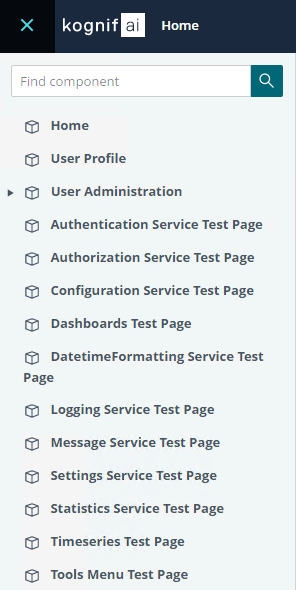
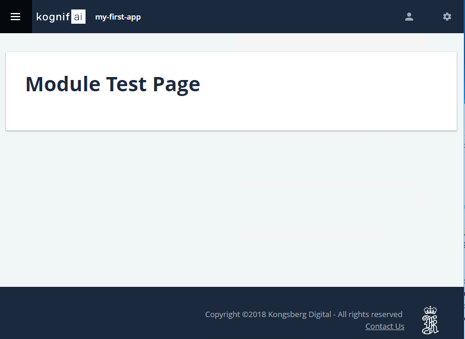
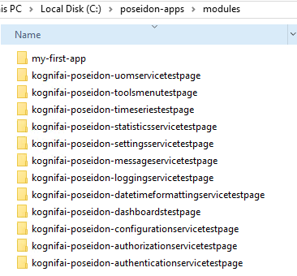

 ```
This is a developer preview and beta version of Poseidon Next.
```
# Prerequisites [](https://gitter.im/kognifai/Lobby)
[NodeJs 8 or greater](https://nodejs.org/)

To check the installed node.js version:
```powershell
node --version
```
# Poseidon Dev Host
## Installation

In order to start developing Poseidon Applications, you must get **@kognifai/poseidon-dev-host**. You can install from NPM globally:
```powershell
npm install -g @kognifai/poseidon-dev-host
```

## Hosting

After you have globally installed  **@kognifai/poseidon-dev-host** you can start it with the following command:
```powershell
poseidon-dev-host --next
```

The console shows a message that it is now listening on http://localhost:8080. 
Opening the browser on this URL loads up the Poseidon Core. 

The host comes with a developer friendly security solution. *Type in any username and password to enter the application*. A full security service will be provided in a future release.

# Installing test modules

There are several test modules that can be used as examples for the services provided by the framework. 
Start by creating an empty directory in your local work directory:
```powershell
mkdir c:\poseidon-apps\test-modules
cd c:\poseidon-apps\test-modules
```
You can use NPM to install the test modules:
```powershell
npm install @kognifai/poseidon-authenticationservicetestpage
npm install @kognifai/poseidon-authorizationservicetestpage
npm install @kognifai/poseidon-configurationservicetestpage
npm install @kognifai/poseidon-datetimeformattingservicetestpage
npm install @kognifai/poseidon-loggingservicetestpage
npm install @kognifai/poseidon-messageservicetestpage
npm install @kognifai/poseidon-settingsservicetestpage
npm install @kognifai/poseidon-statisticsservicetestpage
npm install @kognifai/poseidon-timeseriestestpage
npm install @kognifai/poseidon-toolsmenutestpage
npm install @kognifai/poseidon-uomservicetestpage
```

You can now tell **poseidon-dev-host** to load these modules:
(Remember stop the **poseidon-dev-host** if it is currently running. You can do that by pressing **Ctrl+C** in the console)

```powershell
poseidon-dev-host --next C:\poseidon-apps\test-modules\node_modules\@kognifai
```
The last parameter specifies the directory in which **poseidon-dev-host** looks for modules. A module is considered a directory which contains a module manifest, so the rest of the subdirectories under node_modules (if any) are ignored.
When the command is executed, the host must generate a message listing all the modules, manifests as output, similar to:
```
Scanning modules in C:\poseidon-apps\test-modules\node_modules
                kognifai-poseidon-authenticationservicetestpage.manifest.json
                kognifai-poseidon-authorizationservicetestpage.manifest.json
                ... 
```
Open a browser at http://localhost:8080 in order to see the modules:



## Looking at the module sources 

You can open the source code for each of the test modules in VS Code:
```powershell
code C:\poseidon-apps\test-modules\node_modules\@kognifai/poseidon-authenticationservicetestpage
```
The test modules provide examples on how to use the services provided by the framework.

# Creating a new Poseidon Application
## Installing Yeoman

If you have not yet installed Yeoman, you can do so by executing this command:
```powershell
npm install -g yo
```

## Installing the Yeoman generator
You can install the **kognifai-poseidon** Yeoman generator from NPM:
```powershell
npm install -g @kognifai/generator-poseidon
```

## Using the generator
You must use the generator in an empty directory:
```powershell
mkdir c:\poseidon-apps\modules\my-first-app
cd c:\poseidon-apps\modules\my-first-app
yo @kognifai/poseidon:module
```
**NOTE:**
It is recommended that the application name specified, when using the Yeoman generator is same as the root folder name on disk. If not, open your [my-app-name].manifest.json file after the application Yeoman generator has run and updated the path variable to match your application root folder on disk:

```"path": "/Server/Modules/[root_folder_on_disk]/dist/bundles/testapp.umd#AppModule"```

This is a temporary workaround.

Follow the instructions of the generator to fill in the required information. After the generator completes, you will have a working simple application. 
- You can use VS Code to edit the source code
```powershell
code .
```
- You can use NPM scripts to build, lint, test:
```powershell
npm run build
npm run lint
npm run test
```

## Starting your application
You can start your application in the same way as the test modules. 
Point the **poseidon-dev-host** to the directory of your applications:
```powershell
poseidon-dev-host --next C:\poseidon-apps\modules
```
Open a browser at http://localhost:8080 in order to see your application:



## Running side-by-side with test modules
As NPM was used to install the test modules, they are located under the **c:\poseidon-apps\test-modules\node_modules** directory.
You can simply copy them to your new **C:\poseidon-apps\modules** directory, and you can have them loaded side-by-side with your newly created applications. 




# Using the Kognifai Design System

Kognifai Design System is a collection of design patterns, components, and guidelines for creating unified and coherent UI in the Kognifai ecosystem.

It contains a set of easy-to-use HTML/CSS components. It does not include JavaScript since we aim to be versatile and technology agnostic. Use it together with any JS framework.

To read the documentation head over to [https://designsystem.kognif.ai/](https://designsystem.kognif.ai/)

# Next Steps

Next step is to explore the [Services](Services.md) and tools, they are a part of Poseidon Next.


